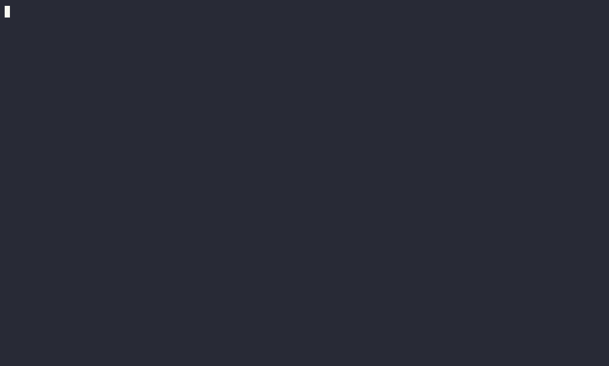
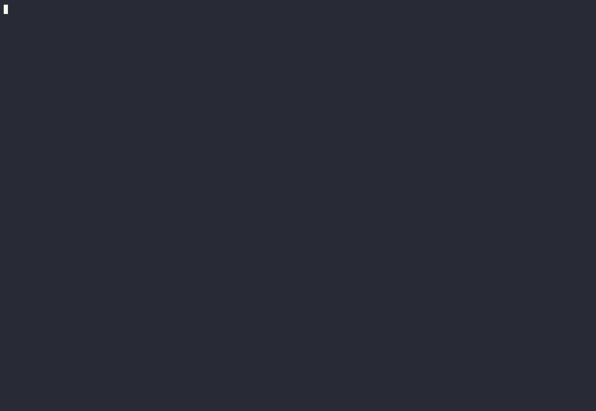

# kamk-cookiecutters

Various cookiecutters for creating course-related files and directories.

## Prerequisites

* Docker (Desktop)

If you have no idea of what cookiecutter is, spend 1-2 minutes reading this short documentation page: [Cookiecutter docs: Overview](https://cookiecutter.readthedocs.io/en/latest/overview.html).

## Usage

We will use Docker to run the cookiecutter command, utilizing **uvx** (an alias for `uv tool run`). The uv is a Python package installer. The command `uv tool` is an interface for running Python-based tools without installation. We will run uv in a Docker container, so the is no need to even install uv. 

Click open the section that matches your environment:

<details>
<summary><strong>🐍 uv (Any OS)</strong></summary>
 

If you **do have** the actual uv (and uvx) installed, the command will be super short and it will also handle line-endings according to your OS without any extra steps. If not, use Docker as described below.

```bash
uvx cookiecutter gh:sourander/kamk-cookiecutters -f
```
</details>

<details>
<summary><strong>🔷 Git Bash (Windows)</strong></summary>

```bash
winpty docker run -it --rm \
-v "/$(pwd):/workspace" \
-w '//workspace' \
ghcr.io/astral-sh/uv:python3.11-bookworm \
uvx cookiecutter gh:sourander/kamk-cookiecutters -f
```

And then, push these to git and immediately fix line endings as well. How? Read more at [#fix-line-endings](#fix-line-endings).

</details>

<details>
<summary><strong>🟦 PowerShell 7.x (Any OS)</strong></summary>

```powershell
docker run -it --rm `
-v "${PWD}:/workspace" `
-w /workspace `
ghcr.io/astral-sh/uv:python3.11-bookworm `
uvx cookiecutter gh:sourander/kamk-cookiecutters -f
```

And then, push these to git and immediately fix line endings as well. How? Read more at [#fix-line-endings](#fix-line-endings).


</details>


<details>
<summary><strong>🐧 Bash (Linux / MacOS)</strong></summary>

```bash
docker run -it --rm \
-v "$(pwd):/workspace" \
-w /workspace \
ghcr.io/astral-sh/uv:python3.11-bookworm \
uvx cookiecutter gh:sourander/kamk-cookiecutters -f
```

🔑 Running as sudo? Read more below. [^1]

</details>

&nbsp;

### Fix Line Endings

*Note that this section is only for Windows users. If you are using Linux or MacOS, you can skip this section. You can continue living in the "it just works" world.* 🌈

Do you **need** to fix this? It is not mandatory, but it is a good practice to have consistent line endings in your project. Also, this *might* add some pain if you are using Windows tools like Notepad for any reason. The **root cause** of this problem is how Windows and Unix-like OSs handle line endings. Windows uses `CRLF` (*Carriage Return and Line Feed*) and Unix-like OSs use `LF` (*only Line Feed*). The container is running linux (Debian Bookworm), and thus, the `cookiecutter` produces files that are, well, UNIX-like. 

When you add the files to the staging for the first time, you will see a warning like this (due to `core.autocrlf` being set to `true` by default in Windows):

```console
$ git add .
warning: in the working copy of '.gitlab-ci.yml', LF will be replaced by CRLF ...
warning: in the working copy of 'HOW-TO-DOCS.md', LF will be replaced by CRLF ...
...
warning: in the working copy of 'docker-compose-docs.yml', LF will be replaced by CRLF ...
```

You can continue commiting the files and push them to the `origin main` (GitLab) as usually. The actual fix happens in after this step.

```bash
git commit -m "Cookiecutter initialized and pushing for GitLab Pages for the first time"
git push
```

Now, the LF's have been replaced by CRLF's, **but only in the commits**, and not in your working directory. To get these fixes applied into your working directory, you need to remove all files from the index and reset the working directory to the last commit. The actual *fix* is in the following commands:

```bash
git rm --cached -r .
git reset --hard
```

Now, if you inspect the bottom right corner of the VS Code while having some of the previously problematic files open, you will see `CRLF` instead of `LF`. In GitLab and in the actual commit, the line endings follow the Unix-like style. Your git performs the conversion automatically when you commit and push the files (assuming the `core.autocrlf==true`).

&nbsp;

### Why the `-f` flag?

The `-f` flag is used to force the cookiecutter to override the existing files. This is required if you want to use the `.` as the target folder, because "this folder" exists.

Running the command above will prompt you to choose a cookiecutter from the list of available cookiecutters. After choosing a cookiecutter, you will be prompted to fill in the required fields. Below is an example of creating a learning diary for a course.

&nbsp;

## Using Templates

When launching the `cookiecutter` command, you will be prompted to choose a cookiecutter from the list of available cookiecutters. The available cookiecutter options are described below. Click to open.

<details>
<summary><strong>Oppimispäiväkirja (learning diary)</strong></summary>



**Animaatio 1:** *Oppimispäiväkirja -mallin valinta ja täyttö.*

**TIP:** If you are interested in creating similar GIF animations, you can use tool `asciinema` for recording and `agg` for GIF conversion. The tools may not be compatible with Windows.

The steps and brief explanations are in the table below:

| Step              | Explanation                                                                       |
| ----------------- | --------------------------------------------------------------------------------- |
| Select a template | 1 (the index of this template)                                                    |
| Course name       | The name of the course you are in. The default value is always shown in brackets. |
| Course slug       | A slugified course name. You typically do not need to change this.                |
| Containing folder | The default is the current folder (`.`). Default requires the `-f` flag.          |
| Author            | Your Full Name.                                                                   |

How to write a learning diary? Read from [Oppimispäiväkirja 101](https://sourander.github.io/oat) (in Finnish).
</details>

<details>
<summary><strong>Project</strong></summary>



**Animaatio 1:** *Projekti -mallin valinta ja täyttö.*

The steps and brief explanations are in the table below:

| Step              | Explanation                                                                 |
| ----------------- | --------------------------------------------------------------------------- |
| Select a template | 2 (the index of this template)                                              |
| Course name       | The name of the course you are in.                                          |
| Group name        | The name of the group you are in.                                           |
| Group authors     | The names of the group members. Separate with a comma.                      |
| Project name      | The name of the project your group is building.                             |
| Project slug      | A slugified project name. Only use a-z and dash. No whitespace, no symbols. |
| Containing folder | The default is the current folder (`.`). Default requires the `-f` flag.    |

How to write a project documentation? The template itself includes a guide for this! Also, the introduction lesson of the course will guide you through the process. If not, ask your teacher.
</details>

<details>
<summary><strong>Itsearviointi (self-evaluation)</strong></summary>

The Itsearviointi example lacks the GIF-animation, since the process is similar to the previous ones. If you want to see what the Cookiecutter-prompting process looks like, check either of the previous examples. The questions and their descriptions are in the table below:

| Step              | Explanation                                                              |
| ----------------- | ------------------------------------------------------------------------ |
| Select a template | 3 (the index of this template)                                           |
| Course name       | The name of the course you are in.                                       |
| Course slug       | A slugified course name. You typically do not need to change this.       |
| Containing folder | The default is the current folder (`.`). Default requires the `-f` flag. |
| Author            | Your Full Name.                                                          |

</details>


## Footnotes

[^1]: Running as sudo? They may be reasons to run the command with `sudo` (e.g., permission issues in a classroom or in a lab space). You will identify this by the error message `Permission denied` to a socker `/var/run/docker.sock`. Running the command again with `sudo` prefix will solve the issue partly. If you do this, the command will work, and template files will be created into your current directory, but the created files will be owned by root. To fix this, you can change ownership like this: `sudo chown -R $(id -u):$(id -g) .`
