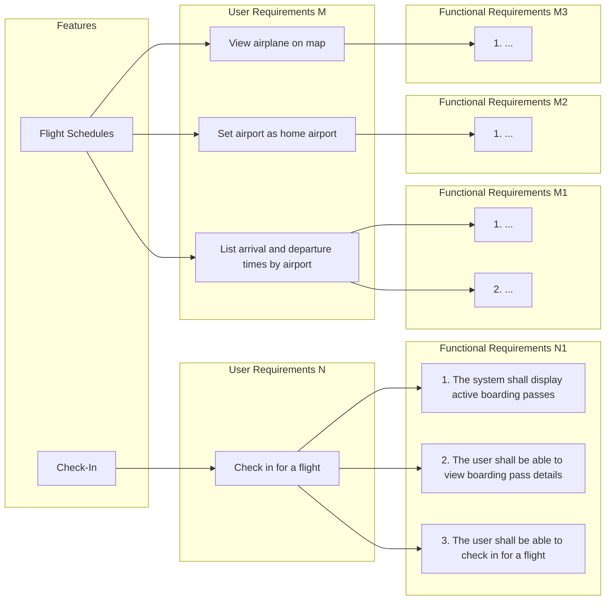

# Software Requirements Specification

## Introduction

This is the Software Requirements Specification (SRS) for the project. The purpose of this document is to describe the requirements that the **system has**.

!!! note

    This template is a single `srs.md` file. For the actual SRS, you may want to split this into multiple files within a folder, like:

    ```bash
    └── srs/
        ├── egg.md
        ├── ham.md
        ├── spam.md
        └── .pages
    ```

    Set the ordering in the `.pages` file.


## Features

A feature is a service that the system provides to the user. It consist of multiple related user requirements.




!!! note

    Product (or system) consist of multiple features. Each feature consist of multiple user requirements. Each user requirement consist of multiple functional requirements.
