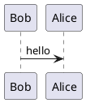

# User Requirements Document

This is the User Requirements Document (URD) for the project. The purpose of this document is to describe the requirements that the **end user has for the system**. It should be written in natural language and is not technical jargon, and it should be written from user's perspective.

You may use diagrams. The Mermaid and PlantUML are supported by the cookiecutter as is, but feel free to modify the Dockerfile and the mkdocs.yml to add support for other diagramming tools. You can also use external software to create e.g. PNG images, but make sure you have some sort of version control for the images.

## Example PUML Diagram

