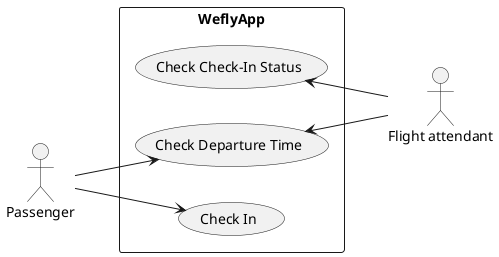

# User Requirements Document

This is the User Requirements Document (URD) for the project. The purpose of this document is to describe the requirements that the **end user has for the system**. It should be written in natural language and is not technical jargon, and it should be written from user's perspective.

Continuying with the airline example, a user story might be a **"Check in for a flight"** task that the passenger wants to perform. The book by Wiegers and Betty puts it like this: *"Written as a user story, the same user requirement might read: "As a passenger, I want to check in for a flight so I can board my airplane."* [^34a4a8]

## User story

The user requirements are typically written in the form of user stories. The user story is a simple sentence that describes the user's need. The user story is written in the form of:

```
As a <type of user>, I want <some goal> so that <some reason>.
```

Here are some examples:

* As a data scientist, I want to be able to upload a CSV file so that I can analyze the data.
* As a data engineer, I want to be able to schedule a data pipeline so that I can automate the data processing.
* As a product owner, I want to be able to see the daily device registrations by country so that I can make data-driven decisions.

## Use of diagrams

Use case diagrams are a great way to present use cases visually. Mermaid lacks this kind of graphs, but you can use PlantUML to create these. PlantUML has been activated as an extension in this Material for MkDocs site (see the `mkdocs.yml` and `docs.Dockerfile` files). Here is an example of a use case diagram:



[^34a4a8]: Karl Wiegers and Joy Beatty. 2013. *Software Requirements (3rd. ed.)*. Microsoft Press, Redmond, WA, USA.