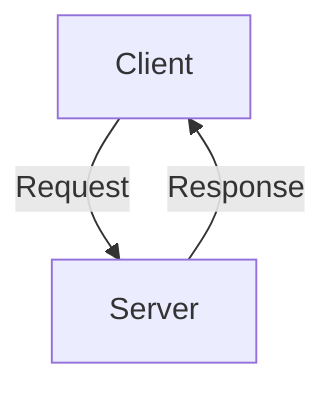
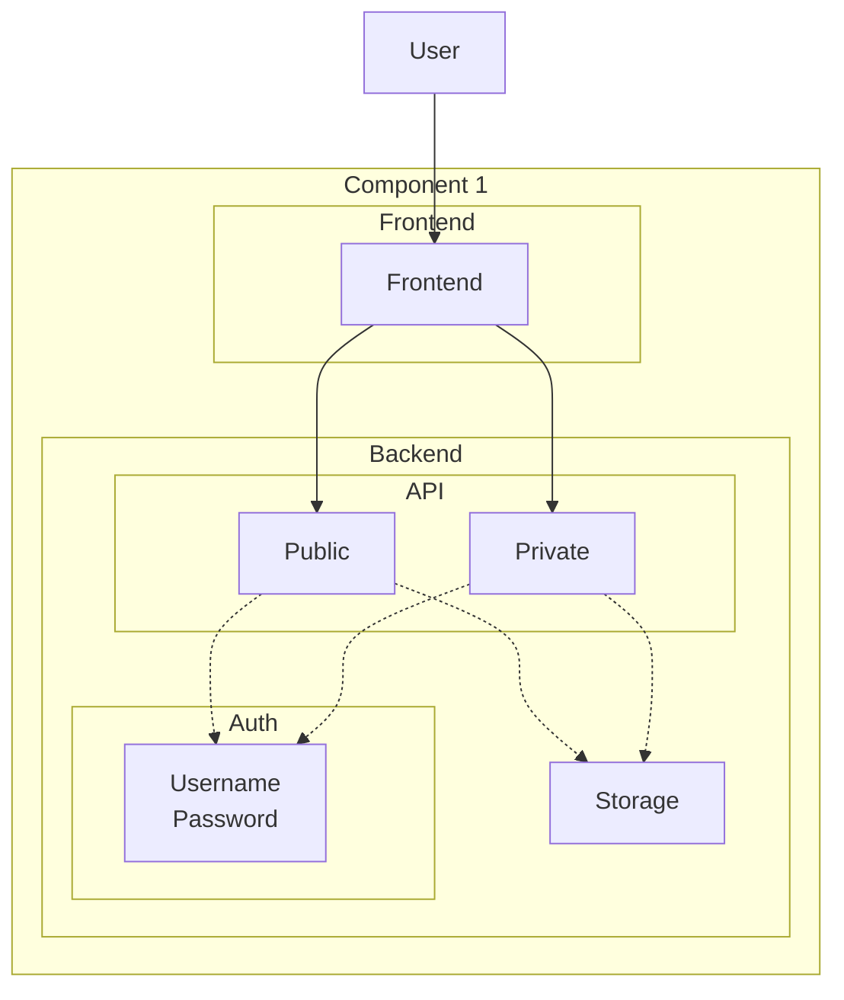
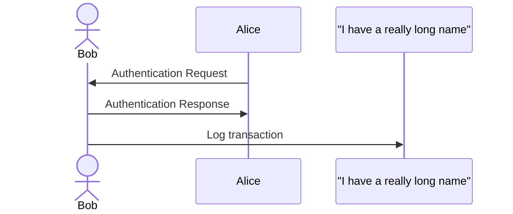
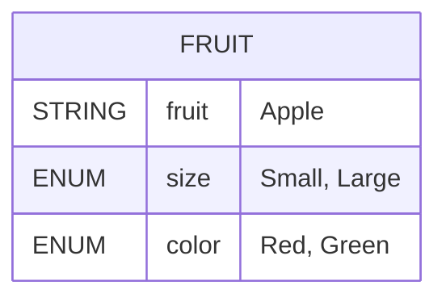

# The Spec

## Architecture

Even though we are avoiding the Big Design Up Front (BDUF), we still need to have a high-level architecture in mind. This is to ensure that the system is scalable, maintainable, and everyone in the team is on the same page. If need be, you can move this arcitechture to a separate document. For now, it is here for the sake of simplicity.

!!! warning "Avoid spaghetti architecture"

    Remember that every system has an architecture. It is either by design or by accident. The latter is most likely a [big ball of mud](http://www.laputan.org/mud/mud.html) or spaghetti architecture.

    > A BIG BALL OF MUD is haphazardly structured, sprawling, sloppy, duct-tape and bailing wire, spaghetti code jungle. We’ve all seen them. These systems show unmistakable signs of unregulated growth, and repeated, expedient repair. Information is shared promiscuously among distant elements of the system, often to the point where nearly all the important information becomes global or duplicated. The overall structure of the system may never have been well defined. If it was, it may have eroded beyond recognition.   - Brian Foote & Joseph Yoder

    

### High-Level Architecture

Prefer to use diagrams to explain the architecture. This is the high-level architecture, the 30,000 foot view. It should be simple enough to be understood by a non-technical person. It should clarify the system's major components ("raviolis") and their interactions. This reveals the inter-component communication, data flow and dependencies.

### Component Diagrams

#### Component 1

Add diagrams explaining the architecture of any components of your system. Below is a dummy example of the server component (from the high-level architecture). This is the 10,000 foot view. Understanding it may require some technical knowledge, but it should NOT be a deep dive into a single component.

#### Component 2

Here you would explain the architecture of another component. You may use different kind of diagrams based on the component's nature. Check the PlantUML reference guide for examples. The potential diagrams include:

* Sequence diagram
* Usecase diagram
* Activity diagram
* Component diagram
* Deployment diagram
* State diagram
* Timing diagram

Below is an example of a sequence diagram (from PlantUML's language referend guide, page 3), but converted to Mermaid so that this site can be hosted on GitLab Pages without PUML server.

## Data Model

This heading is for the data model. Components of the system typically transfer data between each other. This data has a structure. This structure is the data model.

The actual contents depend on what you are building. It could be a database schema, a data flow diagram - or - maybe **a link to**  autogenerated documentation runnning in a another container (within the same Docker compose network, exposed to another port). For example, if you are using Pydantic or protobuf to define your schema as a code, it wouldn't make a lot of sense to manually copy-paste the contents here. Instead, use tools of automation! The team has a lot of freedom over this. Use that freedom wisely.

In simple cases, you might simply write the data model in a YAML format. Below is an example of a ultra simple data model (adapted from PlantUML's language reference guide, page 273), but in Mermaid for reasons mentioned above.

## Product Schedule

Some projects are continuous, some are not. Our University projects have a set deadline. You can visualize it using a Gantt chart or using some other method. The chart may not fit into this page. In that case, link to some external source. Below is an example of Gantt chart from Mermaid's website:

```mermaid
gantt
    dateFormat HH:mm
    axisFormat %H:%M
    Initial milestone : milestone, m1, 17:49, 2m
    Task A : 10m
    Task B : 5m
    Final milestone : milestone, m2, 18:08, 4m
```

