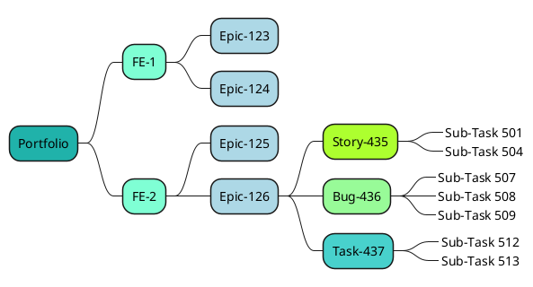
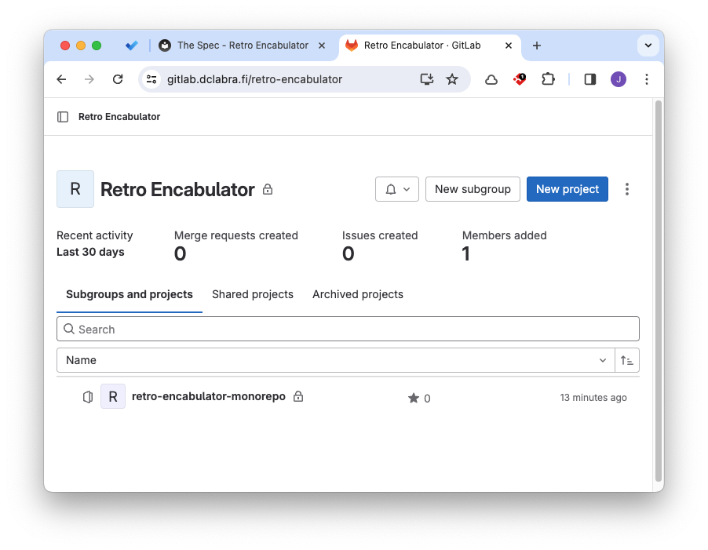
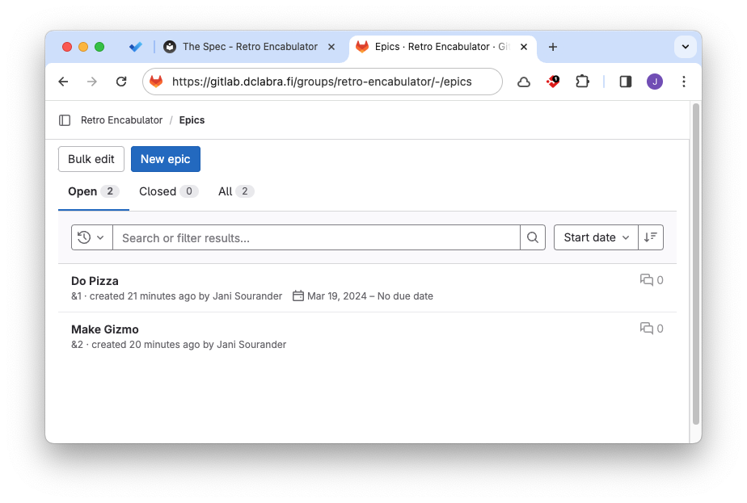
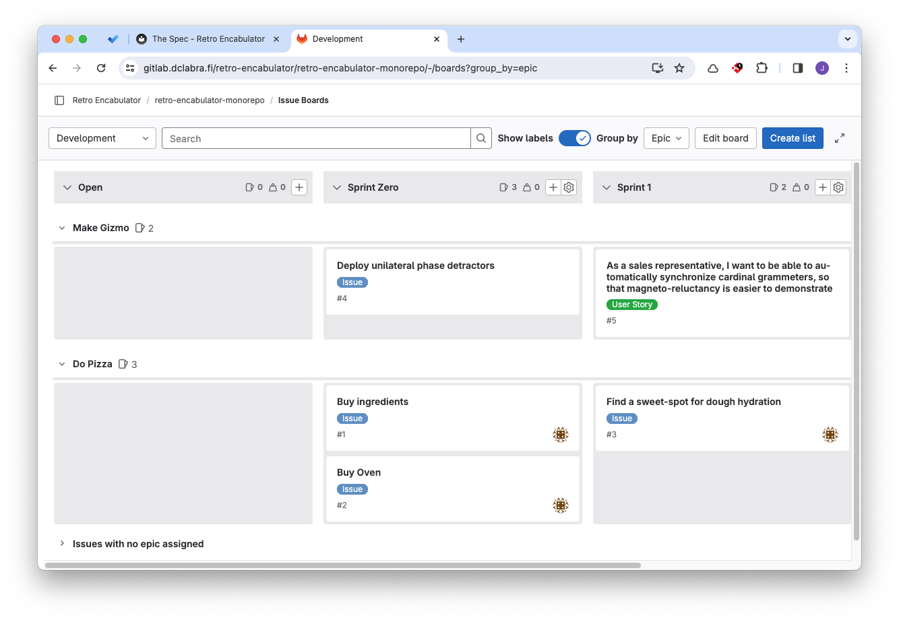

# The Spec

!!! warning

    This page, as well as the whole "Guides" section, should be removed when no longer needed.

## Introduction

This is a guide for writing **The Spec**. The template is in another file: [The Spec (Form)](../forms/spec.md).

## What to include

1. Architecture
    1. High-Level Architecture
    2. Component Diagrams
2. Data Model
3. Product Schedule

## Agile and The Spec

Before diving deeper into the template, we need to clarify some things about the upfront planning process **in the context of Agile**.

### Just-In-Time Planning

**Big Design Up Front (BDUF)** approach is not a good fit for Agile (or Scrum). The Agile manifesto states one of its core values as: *"Working software over comprehensive documentation"*. Thus, in Agile, typical Waterfall artifacts such as Software Requirements Spec (SRS) or Software Design Document (SSD) are not really needed [^0a1d1b].

However, this does not mean we couldn't or shouldn't plan anything upfront [^f01c74]. Planning allows us to avoid aimlessly wandering in the dark. We will design **as little as possible** and **as late as possible**. In other words: we plan **just in time** (JIT).

A pure waterfall approach includes the assumption that most of the communication between the customer and the developer happens at the beginning of the project. Everything is written down in the SRS, and the developers are expected to follow the SRS to the letter. The process of converting (refined) user cases into functional (and also non-functional) requirements is a part of the SRS's writing process. This process is shown in a diagram below. Click the admonition open to see the diagram.

??? info "Functional Requirements in Waterfall"

    In waterfall, functional requirements and their tests are defined in SRS phase. Functional requirements are the "shall" statements and they are the core content of the SRS. Their key audience are the developers and testers.

    ```mermaid
    graph LR

    subgraph Features
        A[Check-In]
        B[Flight Schedules]
    end

    subgraph Refined User Requirements N
        N1[Check in for a flight]
    end

    subgraph Refined User Requirements M
        M1[List arrival and departure times by airport]
        M2[Set airport as home airport]
        M3[View airplane on map]
    end

    subgraph Functional Requirements for N1
        N1.1[1. The system shall display active boarding passes]
        N1.2[2. The user shall be able to view boarding pass details]
        N1.3[3. The user shall be able to check in for a flight]
    end

    subgraph Functional Requirements for M1
        M1.1[1. ...]
        M1.2[2. ...]
    end

    subgraph Functional Requirements for M2
        M2.1[1. ...]
    end

    subgraph Functional Requirements for M3
        M3.1[1. ...]
    end

    A --> N1
    B --> M1
    B --> M2
    B --> M3
    N1 --> N1.1
    N1 --> N1.2
    N1 --> N1.3
    M1 --> M1.1
    M1 --> M1.2
    M2 --> M2.1
    M3 --> M3.1
    ```

We will not be doing this. We will try and practice the Agile way of doing things. Thus, the created document is simply called "The Spec".

### Artifacts in The Spec

It is important to know that feature-rich project management solutions have nested Issue hierarchies: all nodes are Issues, but some Issues have relationships such as `is member of` with other Issues. In practice, this creates a network (or a graph) of Issues. **One possible way** to structure this hierarchy is shown in the diagram below. Note that there is no universal standard for this. Different companies may use different Scrum practices. Can an Epic be contained in another Epic? Maybe, maybe not. It depends on the company's business rules - which hopefully have been documented. Also, the chosen project management tool might have limitations.



Below is some terminology explanations [^61b290]:

* **Portfolio item** 
    * is the system we are designins as a part of the company's product portfolio
    * executives own this
    * we will not worry about during this course
* **Initiatives** (aka Major Features) 
    * are capabilities that add a new functionality to the product. 
    * *example: Online Booking.*
* **Epics** (aka Features)
    * are series of action related to the feature.
    * *example: Booking using a mobile app.*
* **Stories** 
    * are the smallest forms of requirements that can be implemented on their own while still producing some value. 
    * *example: As a user, I want to view my booking history so that I can see what I have booked in the past.*
* **Task, Bug, Maintenance**
    * are all same-level items as Stories
    * *example Task: Allow Booking to access the Database API virtual network.*
    * *example Bug: Empty Bookings history disables scrolling on Safari.*
* **Sub-Task**
    * are the smallest units of work that can be done.
    * does not produce any value on its own.
    * *example: Create a xxxxxx table in the database.*

During this course, we will be creating items of type: Epics, Issues (of any type) and Sub-Tasks in GitLab. The Initiatives are the Major Features in the Vision and Scope document. The Epic descriptions in GitLab should make it clear what the Epic is about, and thus, what Major Feature it is a part of. However, we will not create any entities in GitLab that would represent each Initiative. We will only create Epics, Issues and Sub-Tasks.

## Epics, GitLab and Me

In GitLab, the Epic's can be created when working with a group. These Epic's can then be used in the Projects that are in the group. Thus, even though you might only need a single code repository, you will still **need to create a group in GitLab**.



**Figure 1:** *Working with Epic's requires that your project is represented with a namespace item **group**. In the image above, the Retro Encabulator is a group. All the code is in a monorepo called `retro-encabulator-monorepo`.*



**Figure 2:** *The Epic's are created in the group. In the image, we have two Epic's: "Do Pizza" and "Make Gizmo".*



**Figure 3:** *The Issue Board can be grouped by Epic. Issues without an Epic are part of unorganized backlog. They should be gathered into Epic's during spring planning sessions.*

## How to define The Epics

Forming the Epics and Issues is difficult. It can take a company months or even years to actually start learning how to scope things. The following approaches should help you get started.

### Approach 1: Start from Level 3

This is user-centric approach: start from user needs. Idea is to look at the **User Profiles** and find commonalities. This will likely require a brainstorming session with the team. It might be a good idea to ditch the computer and use a whiteboard or post-it notes. Or, you can use Microsoft Teams' whiteboard feature. Or Miro. Whatever works for you.

This is simple:

1. Gather the user stories you have written in the **User Profiles**.
2. Spawn even more user stories by brainstorming with the team..
3. Write them down: `As a <role>, I want to <something> so that <some reason>`.

After you feel that you have added them all important user stories, find the commonalities and group them into **Epics**. An epic is not a random collection of Issues. They should share the acceptance criteria. Also, if it can be done within a day, it is clearly not large enough for an Epic. One definition of an Epic that it cannot be completed within a single sprint.

??? note "Example: Retro Game Console"

    Imagine that your upcoming product is a hand-held gaming console. The games are distributed as cartridges. The device has one built-in game, a 2D platformer called `Retro Encabulator Sisters`. Based on your customer reserach (queries, user groups, interviews, surveys), you have found a user story that goes like this:

    * As a gamer, I want to be able to save the Encabulator Sisters game state, so that I can continue playing later.

    For a non-technical user, this might sound like a simple feature: 
    
    > Duh, just add like three lines or code, bruh.<br>- xxEliteSniperxx

    In practice, this might be a lot more complicated. During Vision and Scope, there might have been an idea about adding a persistent data storage to the console. Maybe this Major Feature was omitted, since it would add weight to the system or increase the price. Instead of persisting the `Retro Encabulator Sisters`'s game state to the non-volatile memory, you may solve this by serializing the game state and displaying it as a string (e.g. `ABC123`) for the player.

    This user story, and some other similar stories, would spawn an Epic called `Game State`. This Epic may contain multiple Issues. Note that the actual Issues will be fleshed out later, in GitLab, during sprint planning.

    * Develop game state serialization and deserialization
    * Add Load Game functionality
    * Document the Game State feature to DevKit guide.
    ```

### Approach 2: Start from Level 1

Alternative is to start from the **Major Features** and break them down into smaller **Features**. This approach is more system-centric, but sometimes necessary. If a Major Feature is "Four wheel drive", does is spawn some Epic-scale Features?

??? note "Example: Big Data Platform"

    Imagine that your upcoming product is a **Acme Data Platform** for your company, Acme Corporation. During Vision and Scope planning phase, one of Major Features was documented with a title `Data Governance`. 
    
    It is very possible that there is no data steward in the building who would ask for: `As a data stewards, I need a documented framework of organization-wide data business rules.` Instead, you need to start from **Level 1 Major Feature**, the `Data Governance`, and start breaking it down into pieces.

    You might end up with **Level 2** Features (Epics) such as:

    * Implement access control (RBAC or ABAC)
    * Define data sensitivity classification framework
    * Establish auditing trails to track data access and modifications
    * Define data retention and archival policies
    * Conduct training sessions for data stewards on data governance
    * ...

    P.S. The "conduct training sessions" is unlikely going to be the source of GitLab branches or Merge Requests. However, it is still required to be added to GitLab, since we are using GitLab as our project management tool.

!!! tip

    You will likely end up using both approaches! Approach 1 is better for user-centric features, and Approach 2 is better for system-centric features.

### Acceptance Criteria

Add acceptance criteria to each Issue and to each Epic. This will be added in the GitLab to the Issue's description.

!!! tip

    You can use the following questions to define the acceptance criteria. If you do not have an actual customer, answer on their behalf.

    * Developer: If the feature was ready, and we are in a room together, how would I demonstrate that it is ready?
    * Customer: [The reply is the acceptance criteria.]

Notice that the test can be automated or manual, but it has to be specific. It has to be something that you can say `TRUE` or `FALSE` to.

## Software Architecture design

When possible: **show, don't tell**. Thus, we will visualize the software architecture. This can be done using PlantUML, Mermaid, Excalidraw, draw.io or similar. You should visualize both the **high-level** and **low-level architecture**. The former, a 30,000 foot view, is the system architecture. The close-ups, 10,000 foot views, are component diagrams. Use enough detail to make the architecture understandable, but avoid too fine details; there's a better place for these (the reference docs).

## Data Model

Your product will most probably pass data around. This data has a structure. This structure is called a data model. You should document it. PlantUML can be used to visualize the data model as a yaml or as class diagram.

## Product Schedule

Product schedule works are a helping calendar when timing Issues, Epic's and other events in GitLab. Gantt chart may not be the best tool for this, but it is easily available in PlantUML and fits the purpose. Check the example in the Form. Change the dates to match your course schedule.

## Product Roadmap

Product roadmap is a simple, high-level plan of what will be delivered when. We will be using GitLab's **Epic Board** for this purpose. Using GitLab, add estimated start and end dates to the Epic's.

Since we are using Epic Board, there is no need to add the Roadmap to The Spec. However, you should be prepared to show the roadmap to the stakeholders during the demo session.

## Embrace the change

Agile is built around elasticity and adaptivity. The Spec is a living document; nothing more, nothing less. This guide is also just a guide, not a *must obey or suffer for infinity* type of scripture. Also, Scrum methodology is not something you need to follow to the letter. Don't be a purist, be a pragmatist.

Your Team has multiple members with fully functional brains; trust yourselves and your team members! If something doesn't work, adapt. Do not try to "manage" the change, but **embrace the change**!


[^0a1d1b]: Wiegers K. & Beatty J. *Software Requirements (3rd. ed.)*. Microsoft Press. 2013.

[^f01c74]: Sourijit, D. 2022. *How To Write Software Requirement Specifications in Agile*. https://www.browserstack.com/guide/software-requirement-specifications-in-agile

[^85b4b1]: Beedle M et. al. 2001. *Manifesto for Agile Software Development*. https://agilemanifesto.org/

[^61b290]: Layton M, Ostermiller S & Kynaston D. 2022. *Scrum for Dummies, 3rd ed*. Wiley.