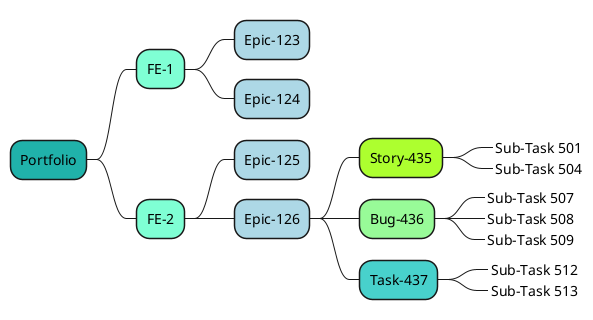

# The Spec

!!! warning

    This page, as well as the whole "Guides" section, should be removed when no longer needed.

## Introduction

This is a guide for writing the User Requirements document. The template (or form) itself is in another file: [User Requirements Template](../forms/srs.md).

!!! warning

    Both Vision and Scope plus the User Profiles should be written before this document.

## What to include

1. Features
    1. FE-1: Major Feature's Name
    2. FE-2: [Short name]
    3. ...
2. Feature Details
    1. EPIC-1: CSV ingestion
    2. EPIC-2: Ham
    3. EPIC-3: Spam
    4. EPIC-4: [Short name]
3. Architecture
4. Data Model
5. Roadmap

## Elephant in the room

Before diving deeper into the template, we need to clarify some things about the upfront planning process **in the context of Agile**.

### Elephant definition

The problem, or the "elephant", is that the **Big Design Up Front (BDUF)** approach is not a good fit for Agile (or Scrum). The Agile manifesto states one of its core values as: *"Working software over comprehensive documentation"*. Thus, in Agile, typical Waterfall artifacts such as Software Requirements Spec (SRS) or Software Design Document (SSD) are not really needed [^d7ae54]. 

However, this does not mean we couldn't or shouldn't plan anything upfront [^f01c74]. This would lead to us aimlessly wandering in the dark. Instead of these massive documents, we will design **as little as possible** and **as late as possible**. For the first ever sprint, also known as Sprint Zero, we will do *some* upfront planning - but just enough to get us going for the first 2 sprints. 

A pure waterfall approach includes the assumption that most of the communication between the customer and the developer happens at the beginning of the project. Everything is written down in the SRS, and the developers are expected to follow the SRS to the letter. The process of converting (refined) user cases into functional (and also non-functional) requirements is a part of the SRS's writing process. This process is shown in a diagram below. Click the admonition open to see the diagram.

By contrast, in Scrum, developers and customers have a close collaboration, and the user stories are converted into team-specific tasks in each **increment or sprint planning**.

!!! question "But my boss ..."

    There are, of course, cases where an old-fashioned or rigid client insists on having a biblically scaled, Courier font-faced requirements document with 3.14 cm margins using a mechanical type-writer and seal everything using a ring with emperors face on it. In that case, you have to write it or find another job.

We will not be doing this. We will try and practice the Agile way of doing things. Thus, the created document is simply called "The Spec".  Just to give you an idea of the alternative approach, you can click the "Functional Requirements in Waterfall" admonition below to open it. It contains a graph of how the functional requirements would be written in a waterfall project.

??? info "Functional Requirements in Waterfall"

    In waterfall, functional requirements and their tests are defined in SRS phase. Functional requirements are the "shall" statements and they are the core content of the SRS. Their key audience are the developers and testers.

    ```mermaid
    graph LR

    subgraph Features
        A[Check-In]
        B[Flight Schedules]
    end

    subgraph Refined User Requirements N
        N1[Check in for a flight]
    end

    subgraph Refined User Requirements M
        M1[List arrival and departure times by airport]
        M2[Set airport as home airport]
        M3[View airplane on map]
    end

    subgraph Functional Requirements for N1
        N1.1[1. The system shall display active boarding passes]
        N1.2[2. The user shall be able to view boarding pass details]
        N1.3[3. The user shall be able to check in for a flight]
    end

    subgraph Functional Requirements for M1
        M1.1[1. ...]
        M1.2[2. ...]
    end

    subgraph Functional Requirements for M2
        M2.1[1. ...]
    end

    subgraph Functional Requirements for M3
        M3.1[1. ...]
    end

    A --> N1
    B --> M1
    B --> M2
    B --> M3
    N1 --> N1.1
    N1 --> N1.2
    N1 --> N1.3
    M1 --> M1.1
    M1 --> M1.2
    M2 --> M2.1
    M3 --> M3.1
    ```

### Elephant goes to GitLab

In Scrum, most of the paperwork can be partially or fully replaced with a feature-rich issue or project management tool. Atlassian JIRA is a popular tool, but we are not using it nor its competitors (such as Monday.com). Those software tend to cost money. **We are using GitLab** for issue management and project management. Relating actions are: 

* setting up the Sprints
* creating Issues
* assigning Issues to developers
* handling the Issue lifecycle (`Unstarted` => `Ongoing` => `Completed`)
* creating branches and merge requests
* discussing merge requests (e.g. code reviews)
* ... amont other things

It is important to know that the aforementioned feature-rich solutions have nested Issue hierarchies: all nodes are Issues, but some Issues have relationships such as `is member of` with other Issues. In practice, this creates a network (or a graph) of Issues. **One possible way** to structure this hierarchy is shown in the diagram below. Note that there is no universal standard for this. Different companies may use different Scrum practices. Can an Epic be contained in another Epic? Maybe, maybe not. It depends on the company's business rules - which hopefully have been documented.



Below is some terminology explanations [^61b290]:

* **Portfolio item** 
    * is the system we are designins as a part of the company's product portfolio
    * executives make decision about this
* **Initiatives** (aka Major Features) 
    * are capabilities that add a new functionality to the product. 
    * *example: Online Booking.*
* **Epics** (aka Features)
    * are series of action related to the feature.
    * *example: Booking using a mobile app.*
* **Stories** 
    * are the smallest forms of requirements that can be implemented on their own while still producing some value. 
    * *example: User can view the booking history.*
* **Task, Bug, Maintenance**
    * are all same-level items as Stories
    * but they have not spawned by `As a <role> I want to <something>` sentences. 
    * Bugs are Q&A found requirements. The user wanted to `something`, but unexpectedly `something else` happened. 
    * Task is something that a Feature requires, but not something that user directly benefit of. 
    * example Task: Allow Booking to access the Database API virtual network.
    * example Bug: Empty Bookings history disables scrolling on Safari.
* **Sub-Task**
    * are the smallest units of work that can be done.
    * does not produce any value on its own.
    * *example: Create a new table in the database.*

This kind of structure **is impossible to create in GitLab** without using JIRA integration. Also, there can be even more levels of dependencies, such as that one Issue must be handled before some other. In a sentence, you would say `is blocked by` or `is prerequisite for`.

!!! question "Test it!"

    Navigate to GitLab and try to create an Epic that contains multiple issues. There really is no way to do this. Or, you can link them, but this link does not effect to how the Issues are rendered at Kanban board or in Issues view.

### Elephant solution

Below is an checkpoint list that shows our plan. Checked items are the ones that we will do. Unchecked items are the ones that we will not do.

!!! success

    - [ ] We will handle Issue hierarchies in GitLab (OMITTED!)
    - [ ] We will write a 100-page SRS document (OMITTED!)
    - [x] We will define **Initiative-Epic** sets
    - [x] We will add **Issues to GitLab** as backlog
    - [x] We will visualize **Product Roadmap**
    - [x] We will visualize **Software Architecture** 
    - [x] We will define **operating environment**
    - [x] We will define **data model**

We will use GitLab for those tasks that GitLab does well (backlog, sprint, labels), and use The Spec to document everything that does not fit that well into GitLab. This inludes defining what our GitLab labels are and what are they used for (which is a business rule). We will also use it to visualize how different requirements or features relate to each other. As a result, the The Spec will be a living document that is updated frequently. Some of it may be generated by code (e.g. data model from Pydantic models), some of it is written by hand.

!!! note

    Even if you had JIRA, you would still likely complement it with something like Confluence. Confluence is a wiki tool that is used to document the requirements and the design. It is a part of the Atlassian suite.

## Gathering Features (Epics)

Now is a good moment to step back and make sure that you understand what entities we have so far and what will be created in The Spec phase. What we have so far are the **Major Features** from Vision and Scope document. We also have the **User Profiles** and **Use Cases** from User Requirements document. Below is a table that gathers all of these entities together. The column `Level` is a made-up term that is used only within this guide. It's purpose is to increase readability.

| Level | Business term          | Scrum term           | GitLab term                 | Home             |
| ----- | ---------------------- | -------------------- | --------------------------- | ---------------- |
| 1     | Major Feature          | Initiative           | `[FE-1] ...`                | Vision and Scope |
| 2     | Feature                | Epic                 | `[FE-1][EPIC-1] ...`        | The Spec         |
| 3     | Functional Requirement | Story/Task/Bug/Other | `[FE-1][EPIC-1] Issue name` | GitLab           |
| 4     | N/A                    | Sub-Task             | Issue's Child Item          | GitLab           |

As of now, you only have Level 1 entities. You need to break them down to Level 2 items, which will be documented in The Spec, and Level 3, which will be added to GitLab as Issues.

!!! question "How big are they?"

    One definition for Epic is that is it an Issue that cannot be done within one sprint.

!!! warning

    Do not start working on Level 4 items yet. This should be done during sprint planning when the Issue is moved to the currently starting sprint.

### Approach 1: Start from Level 3

This is user-centric approach. Idea is to look at the **User Profiles**, **User Cases** and **Major Features** start from there. This will likely require a brainstorming session with the team. It might be a good idea to ditch the computer and use a whiteboard or post-it notes. Or, you can use Microsoft Teams' whiteboard feature. Or Miro. Or whatever works for you.

This is simple:

1. Spawn the user stories.
2. Write them to GitLab as Issues: `[FE-1][MISSING] As a <role>, I want to <something> so that <some reason>`.

After you feel that you have added them all (or at least most of them), find the commonalities and group them into **Features**. This is the Level 2. This is the **Feature** that you will document in The Spec.

1. Find commonalities and group them into **Features**. This is the Level 2 (Epic).
2. Document the Level 2's in The Spec.
3. Define a ID for the Level 2's.
4. Modify the GitLab Issues to include the actual ID: `[FE-1][US-1] As a <role>, I want to <something> so that <some reason>`.

Once you have added these, find the commonalities and group them into **Features**. This is the Level 2. This is the **Feature** that you will document in The Spec.

??? note "Example: Retro Game Console"

    Imagine that your upcoming product is a hand-held gaming console. The games are distributed as cartridges, but the device has one built-in game, a 2D platformer called `Retro Encabulator Sisters`. Based on your customer reserach (queries, user groups, interviews, surveys), you have found out that:

    * As a gamer, I want to be able to save the game state, so that I can continue playing later.

    For a non-technical user, this might sound like a simple feature: 
    
    > Duh, just add game_state.save("20241231-235959.DATA")<br>- xxEliteSniperxx

    In practice, this might be a lot more complicated. During Vision and Scope, there might have been an idea about adding a  persistent data block device to the console. Maybe this Major Feature was omitted, since it would add weight to the system or increase the price. Instead of persisting the `Retro Encabulator Sisters`'s game state to the non-volatile memory, you may solve this by serializing the game state and displaying it as a string (e.g. `ABC123`) for the player.

    This feature would be part of Major Feature `Retro Encabulator Sisters`. It would be a Feature called `Game State`. This Level 2 Feature, an Epic, may contain multiple Level 2 Issues:

    ```txt
    A = ID for Retro Encabulator Sisters
    B = ID for Game State

    [A][B] As a gamer, I want to be able to save the game state, so that I can continue playing later.
    [A][B] Develop game state serialization and deserialization
    [A][B] Add Load Game functionality
    [A][B] Document the Game State feature to DevKit guide.
    [A][B] ...
    ```

### Approach 2: Start from Level 1

Alternative is to start from the **Major Features** and break them down into smaller **Features**. This approach is more system-centric, but sometimes necessary. If a Major Feature is "Four wheel drive", does is spawn some Features that are system-centric? The user may not have a *need* for an `Auto Off` feature that will kick in when speed is over xx km/h, but the car surely would benefit from this.

??? note "Example: Big Data Platform"

    Imagine that your upcoming product is a Acme Data Platform for your company, Acme Corporation. During Vision and Scope planning phase, one of Major Features was documented with a title `Data Governance`. 
    
    It is very possible that there is no data steward in the building who would ask for: `As a data stewards, I need a documented framework of organization-wide data business rules.` Instead, you need to start from **Level 1 Major Feature**, the `Data Governance`, and start breaking it down into pieces.

    You might end up with **Level 2** Features (Epics) such as:

    ```txt
    A = ID for Data Governance
    B = ID for Data Protection and Access Control

    [A][B] Implement access control (RBAC or ABAC)
    [A][B] Define data sensitivity classification framework
    [A][B] Establish auditing trails to track data access and modifications
    [A][B] Define data retention and archival policies
    [A][B] Conduct training sessions for data stewards on data governance
    [A][B] ...
    ```

    P.S. The "conduct training sessions" is unlikely going to be the source of GitLab branches or Merge Requests. However, it is still required to be added to GitLab, since we are using GitLab as our project management tool ("as a JIRA").

!!! tip

    Most probably you will end up using both approaches! Approach 1 is better for user-centric features, and Approach 2 is better for system-centric features.

### Acceptance Criteria

Each Issue should have an acceptance criteria. At minimum, the Level 2 Stories/Issues should have this test defined. Having that said, Epic's can also have acceptance criteria.

!!! tip

    You can use the following questions to define the acceptance criteria. If you do not have an actual customer, answer on their behalf.

    * Developer: If the feature was ready, and we are in a room together, how would I demonstrate that it is ready?
    * Customer: [This is the acceptance criteria.]

Notice that the test can be automated or manual, but it has to be specific. It has to be something that you can say "TRUE" or "FALSE" to.

## Software Architecture design

When possible: **show, don't tell**. Thus, we will visualize the software architecture. This can be done using PlantUML, Mermaid, Excalidraw, draw.io or similar.


## Data Model

Your product will most probably pass data around. This data has a structure. This structure is called a data model. You should document it. PlantUML can be used to visualize the data model as a yaml or as class diagram.

## Product Roadmap

Product roadmap is a simple, high-level plan of what will be delivered when. It is like a gym workout plan with steps like "By this date, I will be able to do 5 push-ups". In this case, five push-ups would be an Epic.

## Embrace the change

Agile is built around elastic and adaptive mechanisms. The Spec is a living document; nothing more, nothing less. This guide is also just a guide, not a *must obey or suffer for infinity* type of scripture. Also, Scrum methodology is not something you need to follow to the letter. Don't be a purist, be a pragmatist.

Your Team has multiple members with fully functional brains; trust yourselves and your team members! If something doesn't work, adapt. Do not try to "manage" the change, but **embrace the change**!


[^d7ae54]: Wiegers K & Beatty J. 2013. *Software Requirements (3rd. ed.)*. Microsoft Press.

[^f01c74]: Sourijit, D. 2022. *How To Write Software Requirement Specifications in Agile*. https://www.browserstack.com/guide/software-requirement-specifications-in-agile

[^85b4b1]: Beedle M et. al. 2001. *Manifesto for Agile Software Development*. https://agilemanifesto.org/

[^61b290]: Layton M, Ostermiller S & Kynaston D. 2022. *Scrum for Dummies, 3rd ed*. Wiley.