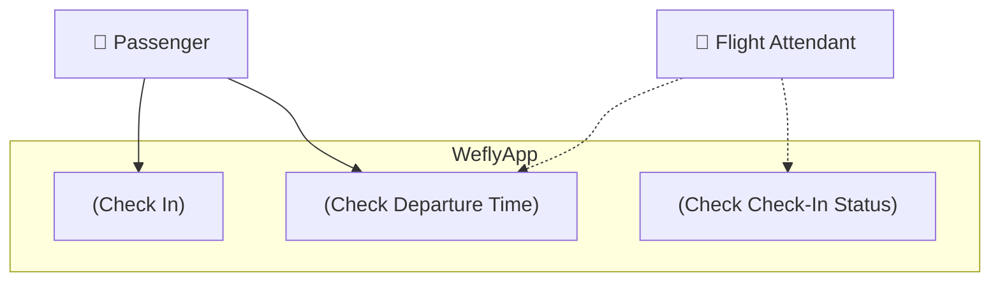

# User Profiles

This is a guide for writing the User Profiles document. The template (or form) itself is in another file: [User Profiles Template](../forms/user.md). 

!!! warning

    The Vision and Scope should be written before this document.

## What to include

1. User profiles
2. Use cases visualized
3. Temporary user stories

## Focus on User's needs

Continuying with the airline example (see: [Vision and Scope guide](vision.md)), a user story might be related to a **"Check in for a flight"** action that the passenger wants to perform. The book by Wiegers and Betty would frame that in a sentence like this: *"As a passenger, I want to check in for a flight so I can board my airplane."* [^0a1d1b]

Notice the format:

```
As a <type of user>, I want <some goal> so that <some reason>.
```

Use cases (and user stories from Agile world) are user-centric, not product-centric. Later on, the system's technical, functional requirements and details are fleshed out using these user cases/stories as a starting point. In Agile, you would have a backlog filled with user stories, and you would work on them in iterations [^0a1d1b].

Here are some examples:

* As a data scientist, I want to be able to upload a CSV using Web UI so that I can add manual look-up data to the system.
* As a data engineer, I want to be able to schedule a data pipeline using cron syntax so that I can reuse the same code among systems.
* As a product owner, I want to be able to see the daily device registrations by country so that I can make data-driven decisions.

## User who?

Before you can decide/gather/elicit the user requirements, you need to **know who the users are**. In the airline example, there may be passengers, flight attendants, pilots, mechanics, management and so on. Different users may have *very different* usage scenarios. They may differ on frequency, privilege level, experience, need of features and so on. The end users have their needs, but maybe you need an admin panel too? Or a dashboard for the management?

## Use case diagrams

Use case diagrams are a great way to present use cases or user stories visually. Mermaid lacks this kind of functionality, but you can use PlantUML to create user case diagrams. PlantUML has been activated as an extension in this Material for MkDocs site (see the `mkdocs.yml` and `docs.Dockerfile` files). You can also draw other useful diagrams such as user interface mocksups. When writing the document, do not think about what you **must** do, instead try to think about what would be **useful** for the stakeholders. The document is a tool for communication. Use whatever means necessary to convey the information.

Here is an example of a use case diagram:



!!! tip

    Note that the diagram above is not a static SVG image. It is rendered using a Material for MkDocs extension + PlantUML server. Check the `docs/docs/documents/user.md` for the diagram source code.


## There is no user

User stories are great for user-facing services such as web applications, handheld devices, kitchen appliances and so on, but there are also systems with little to none human interface. Wiegers and Beatty give the following example: *"Applications such  as batch processes, computationally intensive systems, business analytics, and data warehousing might have just a few user cases. The complexity of these applications lies in the computations performed, the data found and compiled, or the reports generated, not in the user-system interactions."* Lecturer Sourander's experience is that user stories can be used with BI reports and some other user-facing data warehousing related solutions. It may also be used with not-so-user-facing features such as reverse-ETL systems that push data to other systems. In the latter case, the user is the reveicing system's product owner or technical contact. However, there is **a lot of** complexity that is not captured in the user stories. In this kind of cases, you cannot ignore the user stories, but you need to use some other approach for collecting system requirements relating to data model, data flows, data quality, data governance, data security, cluster optimization and so on.

If your project is a data platform, expect that the User Requirements Document will end up being a little thin. The next document in the chain, the Software Requirements Document, will be the one that contains the bulk of the requirements.

Thus, even if there is limited amount of users, we will still create different types of Issues that are typical for Scrum projects. These can be Epics, User Stories, Tasks, Bugs and similar. in the project management tool - depending on what the chosen tool supports.

[^0a1d1b]: Wiegers K. & Beatty J. *Software Requirements (3rd. ed.)*. Microsoft Press. 2013.