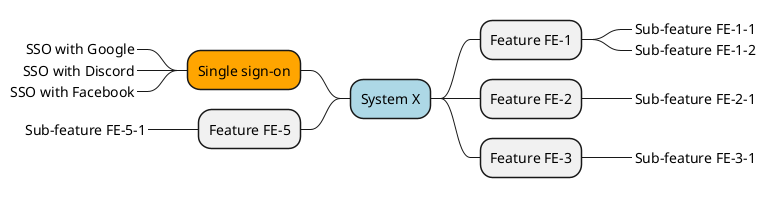

# Vision and Scope

!!! warning

    This page, as well as the whole "Guides" section, should be removed when no longer needed.

This is a guide for writing the Vision and Scope document. The template (or form) itself is in another file: [Vision and Scope Template](../forms/vision.md). When you are writing the Vision and Scope, you should be thinking about **business requirements**. In others word, keep your *business hat* on. This is not the time to think about technical details.

## What to include

You can use the headings in the template as an **"add at least these"** list. If your team has a strong reason to add or modify a section, you should do so. The most important thing is to ensure that the document is clear and understandable to all stakeholders.

1. **Problem Statement**
    1. Project background
    2. Stakeholder profiles
    3. Assumptions
2. **Vision of the Solution**
    1. Vision statement
    2. Business risks
    3. Major features
    4. Features that will not be developed

## Business requirements

Business requirements should be written into the **Problem Statement** section in the Vision and Scope document. The business requirements are the high-level needs of the organization: what is the organization hoping to achieve. Instead of having these hopes and dreams scattered around in chat logs, emails, post-it notes and as tribal knowledge, it is a good idea to gather and document them in one place. **This is that place**. Writing the business requirements down gives all stakeholders a common understanding of what the project is about, what is the background or what are the prior steps taken, what is the expected outcome, and what is inluded and what is not included.

!!! tip

    The vision and scope document is a living document, but:

    * Business requirements should remain fairly stable.
    * Vision should remain fairly stable.
    * Scope can change as the project progresses by each iteration.

     In traditional waterfall projects, the scope is typically fixed at the beginning of the project. In **Agile projects** (e.g. Scrum), the scope can change after each iteration. Each timeboxed iteration is called a sprint. Each sprint will focus on prioritized user stories from the ever-growing backlog.
    
    Waterfall and Agile all the opposite methods, but there are various other phased or incremental approaches that may be used. These land somewhere in-between the two extremes (using e.g. multiple Release Cycles with potentially different durations).

The book Software Requirements gives an example: *"Suppose and airline wants to reduce airport counter staff cost by 25 percent. This goal might lead to the idea of building a kiosk that passengers can use to check in for their flights at the airport."* [^d7ae54] This is a business requirement that you would include in the vision and scope document. You would also inlude the vision of the solution. Vision is the high-level description of the desired outcomes of the project.

## Who provides the business requirements?

The hopes and dreams (or goals) typically come from:

* **Funding sponsor**. An organization or person that is paying for the project.
* **Another department**. Another stakeholder in the organization.
* **Manager of the end user**. A manager who represents the end user. May be from another department.
* **Product visionary**. Product owner (or similar) who represents the end user.

For example, the marketing department might request or propose expanding to new territories. Based on their research, they have found that the company could increase user base by `xx %` if the software was available in `<language>` or in `<country or region>`. This is a business opportunity.

Another example could be that the executives want to increase the customer satisfaction regarding the support call queues from `X` to `Y`  after hearing how `Acme Corporation` has used a chatbot to answer the most common questions in a similar business case. This is a business opportunity.

Third example would be that the data protection officer has researched that the company is not compliant with the new data protection regulation. Maybe EU is introducing a new regulation and this requires that the customer must be given a way to opt-out from data sharing between the various loosely connected systems that the company has (e.g. `Chat <=> Posts <=> Marketing <=> Jobs` if the company is a social media platform and a job board). This is not a business opportunity, but a problem to solve. This also can be a business requirement.

!!! question "But we're students, not a corporation!"

    In our context, as learners at Kajaani Ammattikorkeakoulu, the requirements typically originate from:

    1. A **real** comission from a company
    2. A **fake** comission from a teacher
    3. A **made up** comission that the team has come up with

## Why not simply start coding?

Human communication is error-prone. The vision and scope document is a way to ensure that everyone is mostly on the same page. Note that there will always be room for misunderstandings and someone will end up asking for alterations later on. For this, a company has to develop their own business requirements change management process; this will include a way to propose and approve changes to the vision and scope document as well as any other document.

Notice that the process of gathering requirements **might actually include coding and rapid prototyping!** This all depends on the project and the team and the chosen development methodology.

!!! warning "Avoid assumptions"

    As human, we easily tend to assume things based on our previous experiences. Recall some experiences of your personal life. Try to remember a time when you or someone else assumed something and it turned out to be against unwritten or undocumented rules.

    * "I assumed that the meeting time was CEST, not UTC."
    * "I thought the work had to be submitted as PDF to Moodle, not as a GitLab link."
    * "I understood that we all create our own submissions to our own branches; not that we all aim at merging to main branch."
    * "Why does Jack always end up using various fonts in his PowerPoint slides. We should all stick to the chosen theme."
    * "Oh my god, our new employee is so overdressed for this event! This event has been casual for years."

## What is a Feature?

In the ToC (the heading [What to Include](#what-to-include)) above, there is a section called "Major features". Note that a feature **is not** a technical detail like *"dropdown selectbox values are saved in the browser session state"*. A feature is a service that the system provides to the user and that provides value to the user. Some features are huge and complex, some are tiny. In the vision and scope document, it is helpful to limit the product's features to roughly ten, as this usually results in a degree of complexity that most readers can handle [^cb2bb5]. Develop a label for each feature (e.g. "FE-1") and a short name for the feature.

!!! tip 

    If you have way more than 10 features, try sticking to the major ones. The rest will be documented in the "User Requirements" and "System Requirements" documents.

Below are some examples of features, some of which may be suitable for a vehicle, some for a software system, some for hand-held devices etc.

* Four-wheel drive
* Seats seven passengers
* Holsds a 4 x 1.5 litre bottles of soda
* Foldable
* User accounts
* Single sign-on
* Online payment
* Ambidextrous
* Colorblind mode

If visualizations are your thing, you might want to consider **a feature tree**, **a context map** or **a mind map**. This can help to visualize the features and their relationships. Sadly, PlantUML does not support feature trees, but you can create simple mind maps using PlantUML or Mermaid. Below is a mindmap created with PlantUML. Easiest way to write PlantUML syntax is to stare at the [PlantUML Language Reference Guide (PDF)](https://plantuml.com/guide) while writing it.

Terminology:

* **System X (Blue)** is the system that is being developed.
* **Feature FE-1** is a major feature of the system.
* **Sub-feature FE-1-1** is a sub-feature of the major feature FE-1. This is something we would call "An Epic".

!!! warning

    None of the items above are actually added to GitLab as Issues. We will add one-step tinier items to the backlog as Issues.

[^d7ae54]: Wiegers K & Beatty J. 2013. *Software Requirements (3rd. ed.)*. Microsoft Press.
[^cb2bb5]: Greene J & Stellman A. 2005. *Applied Software Project Management*. O'Reilly Media.